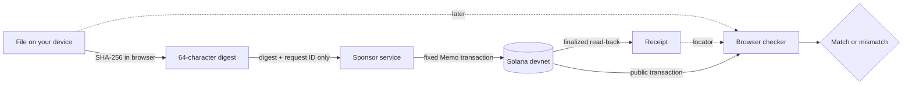

<p align="center">
  
</p>

# ProofStamp via Solana

[](https://github.com/Proof-Stamp/solana/actions/workflows/ci.yml)
[](LICENSE)

**Create and check a file proof on Solana devnet without uploading the file or connecting a wallet.**

**Live devnet demo:** https://solana.proofstamp.org

> **Devnet prototype.** Solana devnet can reset and RPC providers may stop serving old history. Do not treat this as permanent or legal evidence.

A selected file is hashed in the browser with SHA-256. A small sponsor service records only that digest in a canonical Solana Memo transaction. The browser waits for finalization, reads the transaction back, and only then creates a receipt. Later, the original file and receipt can be checked against the public transaction.

- **Stays on your device:** the selected file and its filename. Application code does not submit either one.
- **Becomes public:** the SHA-256 digest plus normal Solana transaction metadata, including timing and fee-payer activity.
- **A match establishes:** the exact file bytes match the digest in the selected public Solana transaction.
- **A match does not establish:** authorship, truth, capture time, delivery, acceptance, or the truth of a date written inside the file.

Keep the original file and receipt. ProofStamp cannot recover a lost original.

<a id="how-it-works"></a>
## How it works



The sponsor endpoint accepts exactly `protocolVersion`, a UUID v4 `requestId`, and a lowercase SHA-256 digest. The server constructs and signs the transaction. It does not accept file bytes, filenames, arbitrary instructions, programs, addresses, serialized transactions, RPC URLs, or fee settings.

The on-chain Memo payload is exactly:

```text
proofstamp:v1:sha256:<64 lowercase hexadecimal characters>
```

Creation is not considered successful when the POST returns. The browser waits for Solana finalization, reads the transaction back independently, and confirms that the public Memo contains the expected digest. If a transaction signature is already known and confirmation or read-back fails, recovery checks that same transaction rather than blindly submitting another stamp.

Verification requests `maxSupportedTransactionVersion: 0`, accepts supported legacy/v0 transactions, checks the configured devnet genesis hash, validates the canonical Memo program, and treats the public transaction as authoritative. Receipt metadata cannot override the digest, slot, program, or block time read from the chain.

## Architecture

- React + TypeScript + Vite frontend
- Web Crypto SHA-256 over exact selected file bytes
- Cloudflare Pages Function at `/api/stamps`
- `@solana/kit` + `@solana-program/memo` for server-side transaction construction
- dedicated operator-controlled **devnet** fee payer
- browser JSON-RPC verification and finalized transaction read-back
- no user wallet, seed phrase, passkey, ZeroDev dependency, custom Solana program, or application database in v1

The current file limit is 25 MiB.

## Run locally

Requirements: Node **24.15+** and npm **12.0.2+**. The repository pins Node in `.nvmrc`, pins npm in `package.json`, and commits `package-lock.json`.

For frontend work and verification:

```bash
npm install --global npm@12.0.2
npm ci --ignore-scripts
cp .env.example .env.local
npm run dev
```

Vite normally serves `http://localhost:5173`. Sponsored creation requires the local Pages service and a dedicated devnet signer.

For the full local path:

```bash
npm install --global npm@12.0.2
npm ci --ignore-scripts
cp .env.example .env.local
cp .dev.vars.example .dev.vars
# Add a dedicated devnet signer to .dev.vars. Never commit it.
npm run build
npm run pages:dev
```

Wrangler normally serves the built app at `http://localhost:8788`; use the URL it prints if different. `VITE_*` variables are public browser configuration. Server secrets belong in `.dev.vars` locally and Cloudflare secrets in deployment environments.

## Checks

Run the same checks expected by CI:

```bash
npm run lint
npm run format:check
npm run typecheck
npm test
npm run build
node --check worker/index.mjs
node --check functions/api/stamps.mjs
node -e "import('./worker/index.mjs').then(() => console.log('worker imports ok'))"
node -e "import('./functions/api/stamps.mjs').then(() => console.log('Pages function imports ok'))"
```

`npm run typecheck` is the fast local TypeScript check. `npm run build` also typechecks before producing the Vite bundle. The formatting check is intentionally limited to tooling and CI configuration; it is not a repository-wide formatter.

Automated tests cover hashing, protocol grammar, receipts, submission guardrails, RPC validation, confirmation behavior, recovery state, and interaction regressions. Browser/manual checks are separate release evidence.

## Security, privacy, and limitations

Verification still depends on an RPC returning accurate Solana history. Checking the devnet genesis hash prevents accidental use of another cluster but does not make an RPC cryptographically trustworthy. A public SHA-256 digest is not encryption: someone who already has or can guess a candidate file can hash it and test for a match.

The app uses a server-side submission endpoint, and infrastructure providers may retain operational logs. Do not describe this version as having “no API”, “no backend”, or “no stored data”.

Before enabling or operating sponsored creation, keep the fee payer devnet-only and low-balance, keep signer/RPC credentials out of browser configuration, maintain an abuse-control layer for `/api/stamps`, and keep the `SUBMISSION_ENABLED` kill switch available.

See:

- [CONTRIBUTING.md](CONTRIBUTING.md) for development and pull-request expectations
- [SECURITY.md](SECURITY.md) for reporting, trust boundaries, and safeguards
- [PRIVACY.md](PRIVACY.md) for data handling and provider logging
- [DISCLAIMER.md](DISCLAIMER.md) for prototype and proof limitations
- [TRADEMARKS.md](TRADEMARKS.md) for ProofStamp name and branding terms
- [RELEASE.md](RELEASE.md) for current operational release checks and historical evidence links

MIT licensed. See [LICENSE](LICENSE).
