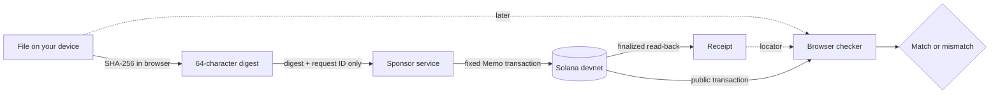

<p align="center">
  
</p>

# ProofStamp via Solana

**Create and check a file proof on Solana devnet without uploading the file or connecting a wallet.**

**Live devnet demo:** https://solana.proofstamp.org

> **Devnet prototype.** Solana devnet can reset and RPC providers may stop serving old history. Do not treat this as permanent or legal evidence.

A file is hashed in the browser with SHA-256. A small sponsor service records only that digest in a canonical Solana Memo transaction. Later, the same file and receipt can be checked against the public transaction.

- **Stays on your device:** the selected file and its filename. Application code does not submit either one.
- **Becomes public:** the SHA-256 digest plus normal Solana transaction metadata, including timing and fee-payer activity.
- **A match establishes:** the exact file bytes match the digest in the selected public Solana transaction.
- **A match does not establish:** authorship, truth, photo capture time, delivery, acceptance, or the truth of a date written inside the file.

A simple example: save a shared report, create a ProofStamp, and keep the original file with its receipt. If a question comes up later, check that exact file against the public record. An edited copy produces a different digest.

<a id="v1-flow"></a>
## How it works



The sponsor endpoint accepts exactly `protocolVersion`, a UUID v4 `requestId`, and a lowercase SHA-256 digest. The server constructs and signs the transaction. It does not accept file bytes, filenames, arbitrary instructions, programs, addresses, serialized transactions, RPC URLs, or fee settings.

Creation is not considered successful when the POST returns. The browser waits for Solana finalization, reads the transaction back independently, validates the public Memo, and confirms that the on-chain digest is the digest it intended to record.

If a transaction signature is already known but confirmation or RPC read-back fails, the UI keeps that signature and lets the user check the same transaction again. That recovery path does **not** send another stamp request. A lost submission response remains an ambiguous outcome and is not blindly retried.

## Protocol

The on-chain Memo payload is exactly:

```text
proofstamp:v1:sha256:<64 lowercase hexadecimal characters>
```

Canonical Memo program:

```text
MemoSq4gqABAXKb96qnH8TysNcWxMyWCqXgDLGmfcHr
```

The checker accepts legacy and v0 transactions and requests `maxSupportedTransactionVersion: 0` from RPC. The receipt is a locator plus convenience metadata. During checking, the public transaction is authoritative. Edited receipt metadata cannot replace the digest, slot, program, or block time read from the chain.

Solana's reported block time is the network's reported/estimated production time for the transaction. It is not the file's creation date, photo capture time, device time, or proof of an earlier date written inside the file.

## Architecture

- React + TypeScript + Vite frontend
- Web Crypto SHA-256 over exact selected file bytes
- Cloudflare Pages Function at `/api/stamps`
- `@solana/kit` + `@solana-program/memo` for server-side transaction construction
- dedicated operator-controlled **devnet** fee payer
- browser JSON-RPC verification and finalized transaction read-back
- no user wallet, seed phrase, token balance, passkey, ZeroDev dependency, custom Solana program, or application database in v1

The app does have a backend API for sponsored creation, and infrastructure providers may produce operational logs. See [PRIVACY.md](PRIVACY.md).

## Run it locally

Requirements: Node **24.15+** and npm **12.0.2+**. The repository pins Node in `.nvmrc`, pins npm in `package.json`, and commits `package-lock.json`.

### Frontend-only development

Use this when working on browser UI or verification. Verification talks directly to the configured public devnet RPC. Sponsored creation will not work unless you also run the local Pages service and point the frontend at it.

```bash
npm install --global npm@12.0.2
npm ci --ignore-scripts
cp .env.example .env.local
npm run dev
```

Vite serves the frontend at `http://localhost:5173`.

Every `VITE_*` variable is public because Vite bundles it into browser code:

```text
VITE_SOLANA_RPC_URL=https://api.devnet.solana.com
VITE_SOLANA_RPC_FALLBACK_URL=
VITE_SUBMIT_API_BASE=
```

### Full local creation + verification

The simplest full-path setup uses the existing Cloudflare Pages development route so the frontend and `/api/stamps` share one origin.

```bash
npm install --global npm@12.0.2
npm ci --ignore-scripts
cp .env.example .env.local
cp .dev.vars.example .dev.vars
# Edit .dev.vars and supply a dedicated devnet signer. Never commit it.
npm run build
npm run pages:dev
```

Wrangler normally serves the built app on `http://localhost:8788`. Open the URL Wrangler prints if it chooses another port.

`.dev.vars` contains server-only values. They are not browser configuration and must never use the `VITE_` prefix:

```text
SOLANA_RPC_URL=https://api.devnet.solana.com
SOLANA_EXPECTED_GENESIS_HASH=EtWTRABZaYq6iMfeYKouRu166VU2xqa1wcaWoxPkrZBG
SOLANA_FEE_PAYER_SECRET=<dedicated devnet key material>
SUBMISSION_ENABLED=true
ALLOWED_ORIGIN=
```

Use a dedicated devnet signer with only a small devnet balance. Supported secret encodings are documented by the example file and server code. `.dev.vars`, `.env`, `.env.local`, build output, Wrangler state, and logs are ignored by Git.

For split development, run the Pages service and Vite separately, set `VITE_SUBMIT_API_BASE` to the local Pages origin, and set `ALLOWED_ORIGIN=http://localhost:5173` in `.dev.vars`.

## Checks

Run the same core checks expected by CI:

```bash
npm test
npm run build
node --check worker/index.mjs
node --check functions/api/stamps.mjs
node -e "import('./worker/index.mjs').then(() => console.log('worker imports ok'))"
node -e "import('./functions/api/stamps.mjs').then(() => console.log('Pages function imports ok'))"
```

`npm run build` includes TypeScript checking. This project does not currently claim separate lint or formatting checks.

The automated suite covers protocol grammar, hashing, receipts, submission guardrails, RPC outcomes, confirmation behavior, and UI-state recovery helpers. Browser interaction checks remain separate from those unit tests.

## Verification assumptions and limits

Keep the original file and its receipt. ProofStamp cannot recover a lost original.

Verification still depends on an RPC returning accurate Solana history. The checker validates the devnet genesis hash to prevent accidental use of another cluster, but that does not make an RPC cryptographically trustworthy. A public SHA-256 digest is not encryption: someone who already has or can guess a candidate file can hash it and test for a match.

The current file limit is 25 MiB. Devnet can reset. Historical RPC access may disappear. This prototype makes no permanence, identity, authorship, truth, delivery, acceptance, or legal-effect claim.

## Deployment notes

Cloudflare Pages production deployment: https://solana.proofstamp.org

Recommended Git deployment settings:

```text
Repository: Proof-Stamp/solana
Production branch: main
Build command: npm install --global npm@12.0.2 && npm ci --ignore-scripts && npm run build
Build output directory: dist
Root directory: /
```

`wrangler.jsonc` defaults sponsored creation to disabled, disables it in previews, and explicitly enables it for production. Production RPC credentials and signer material belong in Cloudflare secrets. Preview must not receive the production fee-payer secret.

Cloudflare provides `CF_PAGES_COMMIT_SHA` and `CF_PAGES_URL` during builds. Vite embeds them as `proofstamp-build` and `proofstamp-deployment` meta tags so an operator can compare a deployment with the reviewed Git commit.

Before public traffic, independently verify rate limiting or equivalent abuse control for `/api/stamps`, keep the signer balance small, and confirm the `SUBMISSION_ENABLED` kill switch. CORS is not an abuse control.

Run the network preflight when changing RPC configuration:

```bash
node scripts/check-devnet.mjs
```

## Contributing and security

See [CONTRIBUTING.md](CONTRIBUTING.md) for setup and pull-request expectations, [SECURITY.md](SECURITY.md) for security reporting and trust boundaries, and [RELEASE.md](RELEASE.md) for release evidence and owner-only actions.

MIT licensed. See [LICENSE](LICENSE).
